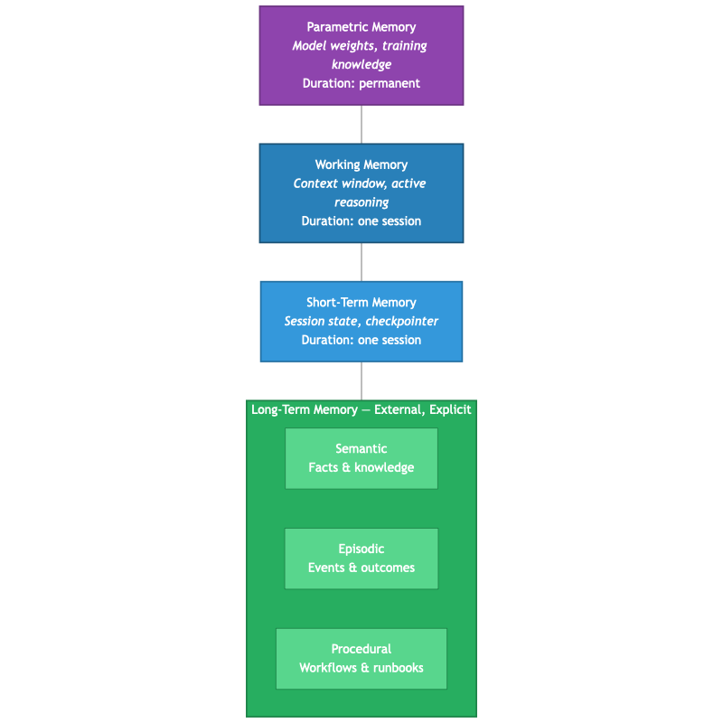

# Chapter 1: Why Context Windows Are Not Memory

A common first reaction to the agent memory problem: "Why bother? Context windows are 200K tokens now. Just stuff everything in the prompt."

It's worth testing that assumption. For a single session, large context works surprisingly well. The agent holds the entire conversation, all retrieved documents, and a reasonable amount of history. But the next day, when the same user asks a follow-up question, the agent has no idea what was discussed. Two hundred thousand tokens of capacity, and it can't remember yesterday.

Context windows are getting larger — 200K tokens, 1M tokens, and architectures like Titans (Behrouz et al., 2024) that push toward 2M+ tokens with neural long-term memory modules built into the model. The relationship between context and memory is more nuanced than "one replaces the other," and understanding the distinction is essential for designing memory systems.

## Context as Working Memory

In cognitive science, working memory is the information actively held in mind during a task — limited, temporary, and discarded when the task ends. The LLM context window maps to this:

| Property | Human Working Memory | LLM Context Window |
|----------|---------------------|-------------------|
| Capacity | ~7 items (Miller, 1956) | 200K+ tokens |
| Duration | Seconds to minutes | One session |
| Persistence | Lost when attention shifts | Lost when session ends |
| Purpose | Active processing | Active reasoning |

Even a very large context window is **session-scoped.** When the conversation ends, everything in the window is gone. The agent knows nothing from previous sessions, previous days, or previous users — unless that information is explicitly retrieved and injected.

## Three Reasons Context Doesn't Replace Memory

### 1. Cross-Session Persistence

An agent with a 200K context window can hold an entire codebase during one session. But:

- What did this agent learn about your infrastructure last week?
- What incident did it resolve three months ago?
- What patterns has it observed across hundreds of interactions?

The context window cannot answer these questions. It wasn't present for those sessions.

### 2. Retrieval Quality Under Scale

Research on long-context models (Liu et al., "Lost in the Middle," 2023) demonstrated that LLMs attend non-uniformly to long contexts. Information placed in the middle of a long context is retrieved less reliably than information at the beginning or end.

This means that even with large contexts, stuffing hundreds of thousands of tokens of historical data creates a retrieval quality problem. A structured search that surfaces the most relevant 5-10 memories and places them at the top of the context can outperform brute-force context inclusion — with lower cost and latency.

### 3. Structured Knowledge Doesn't Fit Raw Context

An agent's memory should include structured signals that don't naturally fit into a text context window:
- **Outcomes:** Did this approach succeed or fail?
- **Temporal context:** When did this happen? How long did it take?
- **Provenance:** Which agent generated this? From which session?
- **Usage patterns:** How often has this been recalled? Has it been useful?

These are structured data fields that belong in a database with typed records, indexes, and query capabilities — not in a flat text buffer.

## The Memory Hierarchy

Human cognition operates with a memory hierarchy. Agent systems are converging on a similar structure:

Recent work like Titans (Behrouz et al., 2024) explores building long-term memory into the neural architecture itself — a neural memory module that learns to memorize historical context as part of the model's forward pass. This is a form of **parametric long-term memory** — implicit, learned, and embedded in model weights.

External memory systems (the focus of this book) provide **explicit long-term memory** — content that is stored, retrieved, and managed outside the model. Both forms have roles to play:

| Dimension | Parametric | Explicit |
|-----------|-----------|----------|
| **Stores** | Patterns, associations | Facts, events, procedures |
| **Access** | Implicit, during inference | Search query returns results |
| **Mutability** | Changes with fine-tuning | Changes with write ops |
| **Explainability** | Opaque | Auditable |
| **Portability** | Tied to the model | Backend-independent |

The two are complementary. A model with strong parametric memory (from pre-training or fine-tuning) benefits from explicit memory for the specific, evolving, and auditable knowledge that changes faster than retraining cycles.

## From Cognitive Science to Design Patterns

The CoALA framework (Sumers et al., 2023) formalized the mapping between cognitive architectures and LLM agent design. The Zhang et al. survey (2024) catalogued memory mechanisms across dozens of agent systems. Both converge on the same taxonomy:

| Memory Type | Cognitive Role | Agent Equivalent | Persistence |
|------------|---------------|-----------------|-------------|
| **Working** | Active thought | Context window | Current session only |
| **Short-term** | Recent recall | Checkpointer state | Current session only |
| **Semantic** | Facts, knowledge | Domain knowledge | Persists across sessions |
| **Episodic** | Experiences | Incident records, outcomes | Persists across sessions |
| **Procedural** | Skills, how-to | Runbooks, workflows | Persists across sessions |

The bottom three — semantic, episodic, procedural — constitute long-term memory. They require storage infrastructure that outlives any single session, supports search by meaning, and manages knowledge over time.

This infrastructure is the focus of the chapters that follow.

## Context Engineering: Why Memory Retrieval Quality Matters

The industry has broadly shifted from "prompt engineering" — optimizing how instructions are phrased — to what is increasingly called **context engineering**: optimizing what information is placed into the context alongside the instructions. The emerging consensus is that the quality of retrieved context has a larger impact on agent performance than the phrasing of the prompt itself.

Memory retrieval is a core component of context engineering. When an agent faces a situation, the memories that are retrieved and injected into its context directly shape its reasoning, decisions, and actions. Poor retrieval — surfacing irrelevant, stale, or unverified memories — degrades the agent's performance regardless of how well the prompt is written. Effective retrieval — surfacing the most relevant, recent, and proven memories — gives the agent context that a perfectly crafted prompt cannot provide on its own.

This framing is important because it positions memory not as a nice-to-have feature but as a critical component of agent quality. The design decisions explored in this book — what to store, how to score, how to handle staleness — are ultimately about maximizing the quality of context that reaches the agent at decision time.

## The Practical Boundary

In practice, here's where the boundary tends to fall:

If the information was generated during the current conversation and the agent needs it for the current task, it belongs in the context window. The checkpointer handles persistence within the session.

If the information needs to survive a pod restart, a new session, or be accessible to a different agent — it needs external memory. No context window, however large, solves this.

The real question isn't whether agents need memory — the research and practical experience both confirm they do. The real questions are harder: when should they store? what should they store? how should they retrieve? how should memories age? Those questions are the subject of the rest of this book.
