# Chapter 5: Cross-Session Memory Without Contamination

There's a moment of genuine excitement the first time an agent recalls a memory from a previous session and uses it to resolve an incident faster. That excitement fades quickly the first time the agent recalls a six-month-old configuration that has since been changed, applies the outdated fix, and makes things worse. Cross-session memory is a double-edged sword.

Cross-session memory is what separates a knowledgeable agent from a stateless one. But sharing knowledge across sessions introduces real risks that aren't obvious until you encounter them. This chapter examines the contamination problem, explores scoping patterns, and proposes the knowledge building pipeline as an architectural pattern.

## The Contamination Problem

When an agent recalls memories from previous sessions, failure modes emerge that don't exist in single-session systems:

| Risk | Scenario | Consequence |
|------|----------|-------------|
| **Stale information** | Agent recalls a configuration value changed months ago | Incorrect action based on outdated knowledge |
| **Incorrect generalization** | Solution from environment A applied to environment B with different constraints | Wrong remediation, potentially making things worse |
| **Scope leakage** | One tenant's operational data surfaces in another tenant's agent session | Data privacy violation |
| **Bias amplification** | Agent's early (poor) solutions bias all future sessions | Performance degrades rather than improves over time |
| **Contradictory memories** | "Use approach X" from session 1, "Never use X" from session 5 | Agent receives conflicting guidance, unpredictable behavior |

These are not theoretical. Any system that maintains knowledge across sessions will encounter them. The question is not whether to prevent them but how.

## The Isolation-Sharing Spectrum

At one extreme, every session is fully isolated — no cross-session memory at all. This is safe but means the agent never learns. At the other extreme, all memories are shared across all sessions — maximum learning but maximum contamination risk.

The practical middle ground: **session isolation by default, with explicit mechanisms for promoting validated knowledge to shared spaces.**


Most systems start on the left — safe, fully isolated, no cross-session contamination — and carefully move rightward as they gain confidence in their curation and validation mechanisms. The goal is to find the position on this spectrum that maximizes learning while keeping contamination risk within acceptable bounds for the use case.

## Scoping Patterns

### Namespace-Based Scoping

Hierarchical string paths organize memories into logical boundaries:

```
/sessions/{session-id}/     ← per-session (isolated by default)
/knowledge/{domain}/        ← curated shared knowledge
/users/{user-id}/           ← per-user preferences
/agents/{agent-id}/         ← agent-private learnings
```

Search is scoped by namespace prefix. Searching `/sessions/abc123` returns only that session's memories. Searching `/knowledge/` returns all shared knowledge. The agent or orchestrator controls which namespaces to search.

**Strengths:** Simple to implement (string column with prefix matching). Intuitive hierarchy. Dynamic — no configuration needed to create namespaces. The same pattern works across backends.

**Limitations:** Convention-based — any agent CAN search any namespace. No enforcement without an access control layer.

### Graph-Based Scoping

Some systems (particularly those using knowledge graphs) scope access through graph relationships. An agent can traverse only the subgraph it has access to. Entities and relationships carry ownership and visibility attributes.

**Strengths:** Rich access control. Natural for entity-centric knowledge. Temporal scoping (what was true at time T).

**Limitations:** Requires a graph database. More complex to implement and reason about. Harder to migrate between backends.

### Tag and Metadata Scoping

Memories carry metadata tags (tenant_id, project_id, access_level), and retrieval filters on these tags. This is more flexible than namespaces but less structured.

**Strengths:** Flexible, multi-dimensional scoping. Works with any backend that supports metadata filtering.

**Limitations:** No implicit hierarchy. Tag conventions must be enforced externally.

## The Knowledge Building Pipeline

Rather than allowing raw cross-session memory access, an effective pattern interposes a **processing layer** between session memories and shared knowledge. The diagram below illustrates the flow: individual agent sessions write to isolated, session-scoped storage. A processing layer — running after each session or on a schedule — extracts reusable knowledge, validates its accuracy, and deduplicates it against the existing domain knowledge base. Only validated, curated knowledge enters the shared namespaces that future sessions can search.



**The processing layer sits above the storage infrastructure.** It reads raw session memories, applies intelligence (extraction, validation, deduplication), and writes curated knowledge back to shared domain namespaces. This separation means:

- Session isolation is maintained by default
- Only validated knowledge enters shared namespaces
- The processing can be an LLM pipeline, a rules engine, or a human review queue
- The storage layer doesn't need to know about the curation logic

This is also the pattern described as "sleep-time compute" in recent research — processing that happens between sessions to consolidate and organize knowledge, analogous to the hippocampal consolidation that occurs during human sleep.

## Handling Contradictions

When new information contradicts existing memories, the system needs a resolution strategy:

### Last-Write-Wins

The simplest approach. New information overwrites old. Easy to implement but loses history. If the new information is wrong, the correct old information is gone.

### Supersession

New memory explicitly marks the old one as deprecated. Both versions are preserved, but only the current version surfaces in default search results:


```
New memory: "max_connections should be 200"
  └─ supersedes: old-memory-id
Old memory: "max_connections should be 50"
  └─ status: deprecated
  └─ superseded_by: new-memory-id
```

Both versions are preserved. The old memory is hidden from default search results but available for audit and history. This is the temporal edge pattern used in graph-based approaches, simplified for flat storage.

### Temporal Validity

Each fact has `valid_from` and `valid_until` timestamps. Queries default to "currently valid" but can ask for historical state. This is the most principled approach — Zep's Graphiti (Rasmussen et al., 2025) implements this in its temporal knowledge graph.

### The Practical Choice

Supersession is the right starting point for most systems. It handles the most common case (corrected information) without losing history, and it doesn't require the complexity of full temporal validity tracking.

## Lifecycle States

Memories should move through defined states rather than simply existing or not existing:



Each state has distinct retrieval behavior. **Active** memories appear in search results with full scoring. **Deprecated** memories have been superseded by newer information — they are hidden from default results but preserved for historical reference. **Expired** memories have passed their TTL without being accessed — they are not returned by default but remain available for audit queries. **Archived** memories have been moved to cold storage and are accessible only through batch operations.

The transition logic is infrastructure — deterministic rules based on TTL, access patterns, and explicit supersession. The decision to supersede is intelligence — made by the agent, the orchestrator, or a processing pipeline.

## Bringing It Together

The safest starting point for any memory system is session isolation. Memories created during a session remain scoped to that session by default. Cross-session knowledge sharing should require an explicit promotion step — whether that's a background processing pipeline, a human review, or a set of automated rules. Making everything shared by default is a recipe for contamination.

The knowledge building pipeline pattern offers a structured way to achieve safe cross-session sharing. Session memories remain private. A processing layer — running post-session or on a schedule — extracts reusable knowledge, validates it, and promotes it to shared namespaces. This keeps the contamination risks contained while still enabling agents to learn from accumulated experience.

For handling contradictions, supersession provides a practical middle ground between ignoring the problem and implementing full temporal validity tracking. When new information contradicts old information, the new memory explicitly marks the old one as deprecated. Both versions are preserved, but only the current version surfaces in default search results.

Lifecycle states — active, deprecated, expired, archived — give the storage layer a vocabulary for managing memories over time. The transition logic (when to expire, when to archive) is deterministic and infrastructure-level. The decision to supersede one memory with another is an intelligence-level concern, handled by the agent or an orchestration layer above.

One principle worth holding firmly: never permanently delete memories. Storage costs are low and trending lower. The value of information that initially seems useless but later proves critical for diagnosing a recurring issue is difficult to predict. Soft deletion — moving memories to an archived state rather than destroying them — preserves optionality at minimal cost.
