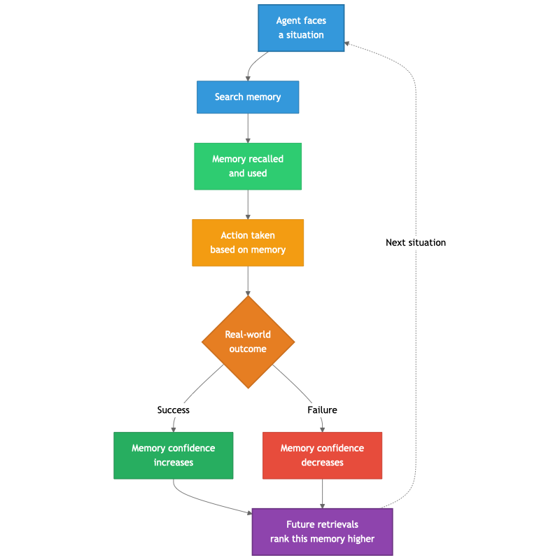
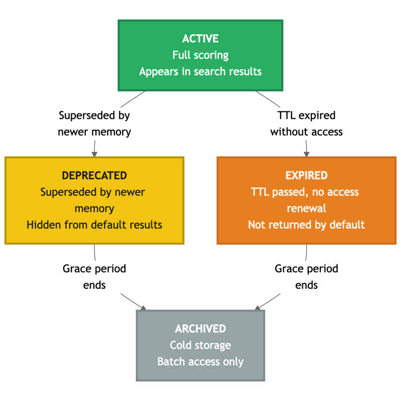

# Chapter 6: Scoring, Decay, and Memory Lifecycle

The previous chapters addressed what to store and how to scope it across sessions. This chapter tackles what happens after memories are stored: how they are ranked during retrieval, how they age over time, and how the full lifecycle — from creation to archival — should be managed.

The central challenge is that vector similarity alone is not sufficient for ranking agent memories. Two memories can match a query equally well semantically but differ enormously in practical value. One may have been recalled dozens of times and led to successful outcomes; the other may be an untested observation from months ago. The retrieval function needs to reflect not just semantic relevance but also trustworthiness, freshness, and proven track record.

This chapter covers three related concerns that together form the memory quality layer:

- **Scoring** — how to rank memories during retrieval, combining semantic similarity with usage signals
- **Decay** — how memories should age, and which decay models fit different use cases
- **Lifecycle management** — how memories transition through states from active to archived, and why this remains the most underserved area in the landscape

## Scoring: Beyond Cosine Similarity

The most widely cited scoring function for agent memory was introduced in the Generative Agents work (Park et al., 2023):

```
Score = α × recency + β × importance + γ × relevance
```

Each component normalized to [0, 1]:
- **Recency:** Decay function based on time since last access
- **Importance:** A score assigned at write time reflecting the memory's significance
- **Relevance:** Cosine similarity between the query and the memory's embedding

This function established the principle that retrieval should consider multiple signals, not just text similarity. Most subsequent work has built on or responded to this foundation.

To see why multiple signals matter, consider a concrete scenario. An agent searches for "pod OOM kills" and two memories match with identical cosine similarity of 0.85. Memory A was stored six months ago and has never been recalled. Memory B was stored two weeks ago, has been recalled fifteen times, and led to successful outcomes in twelve of those cases. With cosine similarity alone, both rank equally. With a multi-signal scoring function that incorporates recency, access frequency, and success rate, Memory B ranks substantially higher — reflecting the practical reality that it is a more trustworthy and proven piece of knowledge.

## Deterministic vs Learned Scoring

A fundamental design trade-off has emerged between two approaches to scoring:

### Deterministic Scoring

A formula with configurable weights:

```
score = W_similarity × cosine + W_policy × (
    W_success × success_rate +
    W_recency × recency_decay +
    W_frequency × normalized_access_count
)
```

| Property | Characteristic |
|----------|---------------|
| Latency | <10ms per evaluation |
| Cost | Negligible compute |
| Consistency | Perfectly reproducible |
| Explainability | "Score is 0.73 because: similarity 0.85, recency 0.65, success_rate 0.80" |
| Adaptability | Change weights via configuration |

### Learned Scoring (RL-Trained)

AgeMem (Yu et al., 2026) demonstrated that reinforcement learning can train memory scoring policies that outperform hand-crafted formulas on long-horizon benchmarks. The agent learns not just what to retrieve but also when to update, summarize, or discard memories.

| Property | Characteristic |
|----------|---------------|
| Performance | Empirically superior on benchmarks |
| Adaptability | Learns domain-specific policies |
| Consistency | Non-deterministic — same input may produce different rankings |
| Explainability | Opaque — "the model ranked it higher" |
| Requirements | RL training infrastructure, model-specific |

### The Complementary View

These approaches are not mutually exclusive. They operate at different layers:

- **Deterministic scoring is infrastructure.** It runs on every search, is fast and explainable, and works with any agent framework. It provides a reliable baseline.
- **Learned scoring is intelligence.** It can be layered on top — an RL-trained agent can use deterministic infrastructure underneath, adding its own reranking on top of the base results.

A practical architecture: the storage layer returns results ranked by deterministic scoring. The agent (or an RL-trained policy above it) can rerank the top-K results using learned preferences. The infrastructure handles the efficient narrowing; the intelligence handles the final selection.

## Decay Functions

The recency component of any scoring function requires a decay model. How fast should memories fade?

### Exponential Decay

```
recency = e^(-λ × days_since_access)
```

Drops sharply. A memory from 30 days ago with typical parameters is nearly invisible. Suitable for operational state that should expire quickly — current deployment versions, temporary workarounds, session-specific context.

### Power Law Decay

```
recency = max(1, days_since_access)^(-α)
```

Decays more slowly. A memory from 30 days ago retains meaningful signal. A memory from 6 months ago is still retrievable if the cosine similarity is strong enough. This matches the Ebbinghaus forgetting curve — the foundational model of human memory decay, which follows a power law, not exponential.

### Which to Choose

For most agent memory use cases, **power law is more appropriate.** An operations agent that resolved a complex incident six months ago should still be able to recall that experience when a similar incident occurs. Exponential decay would have effectively erased it.

Use exponential only for explicitly short-lived data — active deployment state, temporary configurations, session-specific context that should not persist.

The choice should be configurable, not hardcoded. Different namespaces or record types may warrant different decay characteristics — operational state decays fast, domain knowledge decays slowly, procedures may not decay at all.

## The Feedback Loop: Memory Confidence Through Real-World Outcomes

Scoring and decay address how memories age passively. But there is an active dimension that is equally important: **reconciling memory with real-world feedback.**

When an agent recalls a memory and acts on it, the real world provides a signal — did the action succeed or fail? This signal should flow back into the memory's confidence score, creating a feedback loop:



This is the mechanism by which agent memory becomes a **learning system** rather than just a storage system. Without the feedback loop, memory is static — it records what happened but doesn't learn which memories are actually useful. With the feedback loop, frequently helpful memories rise in ranking while memories that led to poor outcomes gradually lose influence.

The feedback loop also provides a natural defense against the contamination problem discussed in Chapter 5. A stale or incorrect memory that is recalled and leads to a failure will have its confidence reduced. Over time, bad memories don't need to be explicitly identified and removed — they are naturally demoted by their track record.

The infrastructure implication is straightforward: the storage layer needs to track success and failure counts per memory, and the scoring function needs to incorporate the resulting success rate. The decision of when to record an outcome — and what constitutes success or failure — is an intelligence-layer concern, determined by the agent or the orchestrator based on the task's objectives.

## Lifecycle Management: The Unsolved Problem

Beyond scoring and decay, the full lifecycle question is the **largest unsolved problem** in agent memory. Every production system today either:
- Accumulates memories indefinitely (growing storage, degrading retrieval quality)
- Relies on manual cleanup (human operators periodically pruning)
- Uses fixed TTLs (hard expiration that loses valuable information)

None of these is satisfactory. A principled lifecycle management system should handle promotion, demotion, and archival automatically based on configurable policies.

### Memory Lifecycle States



### Soft TTL with Access Renewal

Hard expiration (delete after N days) loses valuable information. Soft TTL with access-based renewal preserves actively-used memories while letting unused ones fade:

When a memory is created, its TTL clock starts. If the memory is accessed before the TTL expires, the clock resets — the memory has demonstrated ongoing value and stays active. If the TTL expires without any access, the memory's status transitions to "expired." After a grace period in the expired state, it moves to "archived" — still preserved in cold storage for batch access, but no longer returned in standard searches. At no point is the memory permanently deleted.

TTL base values should vary by memory type:
- Episodic (events): moderate TTL, decays if not recalled
- Semantic (facts): longer TTL, stable knowledge
- Procedural (runbooks): very long TTL or indefinite
- User preferences: indefinite

### Signal Tracking

Lifecycle management requires usage signals tracked automatically on every memory:

| Signal | Updated When | Purpose |
|--------|-------------|---------|
| `access_count` | Every search that returns this memory | Frequency signal, TTL renewal |
| `last_accessed_at` | Every search that returns this memory | Recency signal, TTL renewal |
| `success_count` | Agent reports positive outcome | Success rate calculation |
| `failure_count` | Agent reports negative outcome | Success rate calculation |

These are updated by the storage infrastructure — no LLM calls, no intelligence decisions. Pure bookkeeping that enables both deterministic scoring and lifecycle transitions.

### Tiered Storage

As memory stores grow, not all memories need the same access characteristics:

| Tier | Contents | Access Pattern | Storage |
|------|----------|---------------|---------|
| **Hot** | Active session, recently used | Sub-millisecond | In-memory or fast key-value store |
| **Warm** | Recent sessions, frequently recalled | Low milliseconds | Primary database (vector or relational) |
| **Cold** | Historical, rarely accessed | Higher latency acceptable | Object storage, archival database |

Promotion (cold → warm on frequent access) and demotion (warm → cold after TTL) should be automated based on the same usage signals that drive scoring.

In practice, tiering often aligns with **multi-backend composition** — different storage engines for different tiers, connected by background processing. Hot memories in a fast key-value store for sub-millisecond session lookups, warm memories in a vector database for semantic search, cold memories in object storage for archival. Chapter 7 explores this composition pattern in detail.

### The Never-Delete Principle

A consistent finding across the research: **memories should never be permanently destroyed.** Storage is inexpensive; lost information is irreplaceable. A memory that seems useless today may be the critical link for a future investigation.

Deletion should always be a soft operation — changing status to archived or expired, never physically removing the record. Even "wrong" memories have audit and diagnostic value.

## Consolidation: Processing Between Sessions

The lifecycle isn't just about decay and archival. It also includes **consolidation** — periodic processing that improves memory quality:

- Merging similar memories into richer records
- Generating summaries from groups of related episodic memories
- Updating importance scores based on accumulated usage patterns
- Identifying and resolving contradictions
- Promoting frequently-accessed cold memories to warmer tiers

This maps to what neuroscience calls hippocampal consolidation — the process that occurs during sleep, where the brain replays, strengthens, and reorganizes memories. In agent systems, this is "sleep-time compute" — processing that happens between sessions, not during them.

The storage layer should expose batch APIs that support consolidation workflows. The consolidation logic itself — what to merge, how to summarize, which contradictions to resolve — is intelligence-layer work, handled by the agent, an orchestrator, or a scheduled pipeline.

## Evaluating Memory Quality

A question that every memory implementation must eventually face: how do you know it's actually helping? Building the system is one challenge; knowing whether it improves agent performance is another.

### Measuring Retrieval Quality

The most direct measure is whether the right memories surface at the right time. This can be evaluated at several levels:

**Relevance:** When the agent searches memory, do the results actually relate to the situation at hand? This is the baseline — if retrieval returns irrelevant memories, the rest of the system doesn't matter. Relevance can be measured by sampling search queries and judging whether the top results are meaningful, either through human review or by tracking whether the agent actually uses the recalled memories in its response.

**Precision vs recall trade-off:** Returning too many memories dilutes context. Returning too few misses important knowledge. The `top_k` parameter and the scoring weights together control this balance. Monitoring the ratio of recalled memories that the agent actually references in its output provides a practical signal.

**Staleness rate:** What percentage of recalled memories contain outdated information? This can be measured by tracking the age of recalled memories relative to the last known update in the domain. A high staleness rate indicates that decay and lifecycle policies need tuning.

### Measuring Agent Performance Impact

The ultimate question is whether memory makes the agent better at its job. This requires comparing agent performance with and without memory:

**Task completion efficiency:** Does the agent complete tasks faster (fewer tool calls, fewer turns) when it has access to relevant memories? This is the most direct measure of memory's value.

**Error rate:** Does memory reduce the frequency of incorrect actions? The feedback loop (Chapter 6) provides this signal directly — a high success rate among recalled memories indicates that memory is contributing positively.

**Cold start comparison:** How does the agent perform on its first encounter with a problem type versus its fifth? If there is no improvement, memory isn't being stored or retrieved effectively.

### Practical Evaluation Approaches

For most teams, formal benchmarks are less practical than operational monitoring. A few signals are worth tracking from day one:

- **Memory utilization rate:** How often does the agent actually search and use memory during tasks? Low utilization may indicate poor tool descriptions or insufficient memory content.
- **Outcome-weighted retrieval:** What is the average success rate of recalled memories? This is the feedback loop metric — it tells you whether the memories the agent relies on are trustworthy.
- **Memory growth rate vs retrieval quality:** As the memory store grows, does retrieval quality improve (more relevant memories available) or degrade (more noise to filter through)? This signals whether lifecycle management needs attention.

Establishing these baselines early — even before the memory system is fully mature — provides the data needed to make informed tuning decisions later.

## Closing Thoughts

Of all the improvements one can make to an agent memory system, the most impactful is often the simplest: access tracking. A counter that increments every time a memory is recalled, combined with power law recency decay, transforms retrieval quality more than sophisticated embedding models or prompt engineering.

Scoring doesn't need to be sophisticated to be effective. Start with cosine similarity plus recency plus access frequency. Add outcome tracking when agents begin reporting whether recalled memories were helpful. Consider learned scoring when the training infrastructure exists and the use case demands it.

Lifecycle management — the progression from active to deprecated to expired to archived — is the piece most teams skip. It's also the piece that matters most at scale. A memory system that only grows and never forgets will eventually drown in its own noise. The recommendation is to build lifecycle states in from the start, even if the initial policies are simple. Tuning policies later is straightforward; retrofitting lifecycle management into a system designed without it is significantly harder.
