# Chapter 7: Designing an Agentic Memory System

The previous chapters explored the problem space — what memory is, how it differs from context and RAG, and the design questions that every memory system must answer. This chapter shifts from "what to think about" to "how to design a solution."

What follows is one opinionated approach. It is not the only valid architecture, but it represents a coherent set of trade-offs grounded in the patterns discussed earlier and validated through a working deployment. The focus here is on architectural decisions and their rationale — not on implementation details, which belong in the project documentation of whichever system you choose or build.

## Design Principles

Before diving into components, it is worth stating the principles that guide the architecture. These are deliberate choices, each with alternatives that may be more appropriate for different contexts.

- **Open-source and community-extensible.** The memory layer is foundational infrastructure. Locking it behind a proprietary license or a single vendor limits adoption and creates long-term risk. An open-source core with an extensibility model (third parties can add backends, embedding providers, or scoring strategies without forking) maximizes the ecosystem's ability to evolve the system.

- **Python-native, delivered as a library.** The memory module is something agents import, not a separate service to deploy and manage. This reduces operational overhead and eliminates network latency between the agent and its memory. For Kubernetes deployments, the library runs inside the agent's container, reading configuration from a mounted ConfigMap.

- **Framework-agnostic, with optional integrations.** The core API should work identically whether the agent is built with LangGraph, CrewAI, Google ADK, or raw Python. Framework-specific integrations (e.g., pre-built LangGraph tools) are optional extras, not requirements.

- **Container-enabled, Kubernetes-ready.** The module should run in Docker containers and Kubernetes pods without modification. Deployment artifacts (Helm charts, ConfigMaps, migration jobs) should be provided for K8s environments. The library itself has no dependency on Kubernetes — it runs equally well on a laptop.

- **Extensible backends, swappable by configuration.** Changing the storage backend — from PostgreSQL to OpenSearch to SQLite to a key-value store — should be a configuration change, not a code change. New backends should be addable by implementing a standard interface.

- **Deterministic on the hot path.** No LLM calls during storage or retrieval operations. Embedding generation (a deterministic encoder, not an LLM) is the only model call. Scoring, filtering, and lifecycle transitions are all computed by deterministic formulas and rules.

## Core Design Decisions

### A Minimal API Surface

The API should be small enough to learn in five minutes and powerful enough to handle the full lifecycle described in Chapter 6. The essential operations fall into four categories:

**Storage and retrieval** — the fundamental operations: store a memory with typed metadata, search by semantic similarity with namespace scoping and filtering, retrieve a specific memory by ID, and soft-delete (archive, never permanently destroy).

**Composite retrieval** — a single call that returns similar past episodes, suggested procedures, and known failures for a given situation. This maps directly to the typed record categories and provides structured context rather than a flat list of results.

**Lifecycle and introspection** — recording whether a recalled memory led to a successful or unsuccessful outcome (feeding the scoring function), listing which namespaces contain memories, and retrieving statistics about stored knowledge.

**Batch operations** — supporting the consolidation workflows described in Chapter 6: retrieving all memories from a specific session or time range, identifying stale memories that haven't been accessed, and archiving in bulk.

### Typed Records

The cognitive science taxonomy discussed in Chapter 1 — semantic, episodic, and procedural memory — should be reflected in the storage schema. Each record carries a type discriminator and type-specific structured fields alongside the free-text content and vector embedding.

Semantic records carry confidence and source attribution. Episodic records carry event time, duration, outcome, and the actors involved. Procedural records carry ordered steps, preconditions, and required tools.

This typing enables composite retrieval (search by type) and differentiated lifecycle policies (episodic records may expire faster than procedural ones). It also makes the memory store self-describing — an agent or operator can ask "how many episodic vs procedural memories do we have?" without parsing content.

### Namespace-Based Scoping

Memories are organized into hierarchical namespaces — string paths like `/sessions/abc123/` or `/knowledge/incident-patterns/`. Namespaces are created dynamically when memories are written; there is no configuration step or namespace table.

Search is scoped by namespace prefix. Searching `/knowledge/` returns everything under that namespace and its children. Searching `/sessions/abc123/` returns only that specific session's memories. This provides session isolation by default and controlled sharing through namespace conventions.

The implementation is deliberately simple: a text column with a prefix index. No tree data structure, no parent-child relationships, no recursive queries. String prefix matching achieves hierarchical scoping with zero schema overhead and works identically across different storage backends.

### Backend Abstraction

The storage layer defines an abstract interface — a small set of methods covering storage, retrieval, lifecycle operations, and introspection. Each backend implements this interface for its specific storage engine.

The categories of backends that should be supportable:

| Category | Examples | Strength |
|----------|----------|----------|
| Vector database | pgvector, Milvus | Cosine similarity with HNSW indexes |
| Search engine | OpenSearch, Elasticsearch | Hybrid vector + keyword search |
| Key-value store | DynamoDB, Redis | Sub-millisecond exact lookups |
| Embedded database | SQLite + sqlite-vec | Zero install, single file |

Adding a new backend means implementing the interface and registering it. No changes to the core library or to agents using it. The agent code is backend-agnostic — it calls the same API regardless of what storage engine sits underneath.

### Multi-Backend Composition

For systems that outgrow a single backend, the architecture should support composition — routing different access patterns to different storage engines through configuration:

The primary store (typically a fast key-value or relational database) serves as the source of truth for all writes and exact lookups. A background process extracts insights, generates embeddings, and populates a search index (typically a vector database or search engine) for semantic retrieval. The agent's API is unchanged — the routing happens inside the infrastructure layer.

This pattern is appropriate when access patterns diverge significantly: sub-millisecond session lookups alongside complex semantic similarity searches. For most deployments, a single backend handles both adequately. Composition should be adopted when measured performance or cost data justifies the additional operational complexity.

### Policy-Based Scoring

Retrieval scoring combines cosine similarity with usage-based signals — access frequency, recency (power law decay), and outcome tracking (success/failure ratio). All weights are configurable, all calculations are deterministic, and no LLM is involved in the scoring path.

This provides an explainable, reproducible baseline. Systems that need more sophisticated ranking can layer LLM-based reranking or learned scoring policies on top of the infrastructure's deterministic results — the infrastructure returns raw scores alongside combined scores, giving the intelligence layer full flexibility.

### The Intelligence-Infrastructure Boundary

The boundary between what the memory system handles and what it leaves to the layers above is a critical design decision. Drawing it too broadly creates coupling and complexity; drawing it too narrowly leaves common needs unmet.

The infrastructure layer handles:

- Persistence, indexing, and retrieval across backends
- Typed record storage with structured metadata
- Namespace scoping and access patterns
- Deterministic scoring and ranking
- Lifecycle state transitions (active, deprecated, expired, archived)
- Usage signal tracking (access count, recency, outcomes)
- Batch APIs for consolidation workflows

The intelligence layer (above the infrastructure) handles:

- Deciding what to store and when (trigger logic)
- Extracting structured knowledge from raw data
- Detecting and resolving contradictions between memories
- Full memory evolution (updating existing memories based on new context)
- RL-trained memory policies
- Knowledge graph construction

This boundary keeps the infrastructure fast, deterministic, and portable. Intelligence layers evolve faster than storage infrastructure. By keeping them separate, organizations can change their extraction pipeline without changing their storage, or change their storage without changing their extraction.

## Deployment Considerations

The same library should run identically across deployment contexts. In a development environment, it connects to a local SQLite file with local embeddings — zero cloud dependency. In a container, it connects to a PostgreSQL instance. In Kubernetes, it reads configuration from a ConfigMap and connects to a managed or in-cluster database.

For Kubernetes deployments, the infrastructure should include:

- A Helm chart with ConfigMap-driven configuration
- A database migration job that sets up the schema and indexes
- Support for both managed databases (cloud-hosted) and in-cluster databases (self-contained StatefulSet)
- No separate server process — the library runs inside the agent's container

The deployment mode is a configuration concern, not an architectural one. The same API, the same typed records, the same namespace scoping, the same scoring — regardless of whether the backend is a SQLite file on a laptop or a managed database cluster.

## What This Approach Does NOT Do

Maintaining a clear boundary is as important as the features. This architecture explicitly excludes:

- LLM-powered extraction or summarization
- Automatic contradiction detection
- RL-trained memory management policies
- Full memory evolution (A-Mem-style automatic updating of existing memories)
- Knowledge graph construction

These capabilities are valuable but belong in the layers above the storage infrastructure. The infrastructure provides the foundation — fast writes, semantic search, lifecycle management, multi-backend routing — that these intelligence capabilities build upon.

## Closing Thoughts

The architecture described in this chapter is one coherent answer to the design questions posed in Chapters 3 through 6. It prioritizes modularity (swap backends, swap frameworks), explainability (deterministic scoring, auditable lifecycle), and operational simplicity (library, not a service). These priorities lead to trade-offs — no built-in extraction intelligence, no learned scoring on the hot path, no automatic memory evolution.

Different priorities would lead to different architectures. A team optimizing for task performance above all else might choose AgeMem's RL-trained approach. A team building a knowledge-intensive application might choose a graph-based approach like Graphiti. The value of this chapter is not in prescribing the answer but in making the design decisions and their consequences explicit.

The next chapter illustrates what happens when these design decisions meet a real deployment.
